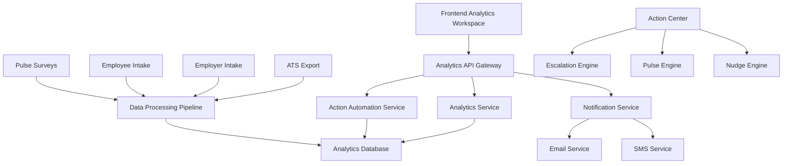

# YourPipeline Analytics V1 - Comprehensive Plan of Action
## Enterprise-Grade Analytics Workspace for Healthcare Retention

---

## Executive Summary

YourPipeline Analytics V1 delivers an enterprise-grade yet operator-friendly analytics workspace for pilot healthcare facilities. The system transforms raw data into actionable insights with embedded interventions, enabling facility leaders to identify retention risks and trigger Pipeline-native interventions within 5 minutes.

**North Star Outcome**: In <5 minutes, a facility leader can see where retention risk is forming and trigger a Pipeline-native intervention.

---

## Strategic Business Context

### The Problem
Healthcare facilities face a critical retention crisis with high turnover costs ($40,000+ per lost employee), no-show rates of 15-25%, and 30% early attrition within the first 90 days. Current systems are reactive, with leaders discovering problems too late to intervene effectively.

### The Solution
YourPipeline Analytics provides a "retention radar" that spots problems before they become costly, automatically escalates issues to the right people, and tracks ROI of every intervention. The system scales across facilities while maintaining focus on Pipeline-native capabilities.

### Competitive Advantage
- **Pipeline-Native**: Built specifically for healthcare workforce challenges
- **Action-Oriented**: Not just data, but specific steps to take
- **Retention-Focused**: Designed to solve the #1 problem in healthcare staffing
- **First-Mover Advantage**: No competitor offers this level of retention analytics

---

## Current State Analysis

### Existing Infrastructure
- **Frontend**: Next.js dashboard with existing analytics components (`/your-pipeline/page.tsx`)
- **Backend**: NestJS API with Prisma ORM and PostgreSQL database
- **Analytics**: Basic tracking system with `analytics_events`, `job_views`, `apply_clicks` tables
- **User Management**: Role-based access (CANDIDATE, EMPLOYER, ADMIN)
- **Data Models**: Basic job, user, and candidate models with healthcare-specific enums

### Current Analytics Capabilities
- Job view and application tracking
- Basic user session analytics
- Admin analytics dashboard
- CSV export functionality
- Real-time event tracking

---

## System Architecture & Design

### Information Architecture

#### Global Controls
- Date range selection (7/30/90/custom)
- Role filter (CNA, LPN, RN, Support)
- Unit/Department filter
- Export/Share capabilities (PDF, CSV, Weekly Brief)

#### Core Analytics Sections

**1. KPI Snapshot Cards**
- Retention Forecast (30/60/90d)
- Predicted No-Show Risk (flag count)
- Estimated Turnover Cost Avoided ($)

**2. Insight Feed (Narrative + Actions)**
- Plain-language insights with contextual actions
- Each action tied to Pipeline-only triggers
- Example: "Rehab unit forecast dropped 12pts vs baseline → [Escalate to Supervisor]"

**3. Cohorts & Funnels**
- Applicants → Hires → 30/60/90 retention
- Cohorts by start week; predicted vs actual

**4. Hotspots (Unit/Role Matrix)**
- Heatmap: units × sentiment, retention forecast, participation
- Drill-down drawers with trends + themes

**5. Action Center**
- All actions tracked with owner, due date, status
- Weekly brief shows action impact

---

## Database Schema Design

### Core Analytics Models

```prisma
model facilities {
  id                String   @id @default(uuid())
  name              String
  type              String   // hospital, ltc, rehab, etc.
  location          String
  contactEmail      String
  contactPhone      String?
  createdAt         DateTime @default(now())
  updatedAt         DateTime @updatedAt
  
  // Relations
  employees         employees[]
  pulse_surveys     pulse_surveys[]
  retention_forecasts retention_forecasts[]
  action_items      action_items[]
  complaints        complaints[]
  analytics_insights analytics_insights[]
}

model employees {
  id                String   @id @default(uuid())
  facilityId        String
  userId            String?  // Link to existing users table
  firstName         String
  lastName          String
  email             String
  role              HealthcareRole
  department        String?
  unit              String?
  hireDate          DateTime
  status            String   @default("active") // active, inactive, terminated
  retentionRisk     Float?  // 0-1 risk score
  createdAt         DateTime @default(now())
  updatedAt         DateTime @updatedAt
  
  // Relations
  facility          facilities @relation(fields: [facilityId], references: [id])
  pulse_responses   pulse_responses[]
  retention_forecasts retention_forecasts[]
  action_items      action_items[]
  
  @@index([facilityId])
  @@index([role])
  @@index([status])
}

model pulse_surveys {
  id                String   @id @default(uuid())
  facilityId        String
  title             String
  questions         Json     // Survey questions structure
  targetRoles       HealthcareRole[]
  targetUnits       String[]
  status            String   @default("draft") // draft, active, completed
  scheduledAt       DateTime?
  completedAt       DateTime?
  createdAt         DateTime @default(now())
  updatedAt         DateTime @updatedAt
  
  // Relations
  facility          facilities @relation(fields: [facilityId], references: [id])
  responses         pulse_responses[]
  
  @@index([facilityId])
  @@index([status])
}

model pulse_responses {
  id                String   @id @default(uuid())
  surveyId          String
  employeeId        String
  responses         Json     // Survey response data
  sentimentScore    Float?   // Calculated sentiment
  submittedAt       DateTime @default(now())
  
  // Relations
  survey            pulse_surveys @relation(fields: [surveyId], references: [id])
  employee          employees @relation(fields: [employeeId], references: [id])
  
  @@unique([surveyId, employeeId])
  @@index([surveyId])
  @@index([employeeId])
}

model retention_forecasts {
  id                String   @id @default(uuid())
  facilityId        String
  employeeId        String?
  cohort            String   // e.g., "2024-Q1", "new-hires-30d"
  forecastType      String   // 30d, 60d, 90d
  predictedRetention Float   // 0-1 probability
  confidence        Float    // 0-1 confidence score
  factors           Json     // Contributing factors
  calculatedAt      DateTime @default(now())
  
  // Relations
  facility          facilities @relation(fields: [facilityId], references: [id])
  employee          employees? @relation(fields: [employeeId], references: [id])
  
  @@index([facilityId])
  @@index([forecastType])
  @@index([calculatedAt])
}

model action_items {
  id                String   @id @default(uuid())
  facilityId        String
  employeeId        String?
  actionType        String   // escalate, pulse, nudge, etc.
  category          String   // hiring, retention, sentiment, etc.
  title             String
  description       String
  priority          String   // low, medium, high, critical
  status            String   @default("pending") // pending, in_progress, completed, cancelled
  assignedTo        String?  // Email or role
  dueDate           DateTime?
  completedAt       DateTime?
  metadata          Json?    // Additional action-specific data
  createdAt         DateTime @default(now())
  updatedAt         DateTime @updatedAt
  
  // Relations
  facility          facilities @relation(fields: [facilityId], references: [id])
  employee          employees? @relation(fields: [employeeId], references: [id])
  
  @@index([facilityId])
  @@index([actionType])
  @@index([status])
  @@index([dueDate])
}

model complaints {
  id                String   @id @default(uuid())
  facilityId        String
  employeeId        String?
  category          String   // safety, harassment, culture, etc.
  description       String
  severity          String   // low, medium, high, critical
  status            String   @default("open") // open, investigating, resolved, closed
  reportedAt        DateTime @default(now())
  resolvedAt        DateTime?
  metadata          Json?    // Additional complaint data
  
  // Relations
  facility          facilities @relation(fields: [facilityId], references: [id])
  employee          employees? @relation(fields: [employeeId], references: [id])
  
  @@index([facilityId])
  @@index([category])
  @@index([severity])
  @@index([status])
}

model analytics_insights {
  id                String   @id @default(uuid())
  facilityId        String
  insightType       String   // retention_drop, sentiment_decline, etc.
  title             String
  description       String
  severity          String   // info, warning, critical
  data              Json     // Supporting data
  actions           Json?    // Suggested actions
  generatedAt       DateTime @default(now())
  acknowledgedAt    DateTime?
  
  // Relations
  facility          facilities @relation(fields: [facilityId], references: [id])
  
  @@index([facilityId])
  @@index([insightType])
  @@index([severity])
  @@index([generatedAt])
}
```

---

## Backend API Architecture

### Analytics Service Layer

```typescript
@Injectable()
export class AnalyticsService {
  // KPI Calculation Methods
  async calculateRetentionForecast(facilityId: string, timeframe: string): Promise<number>
  async calculateNoShowRisk(facilityId: string): Promise<number>
  async calculateTurnoverCostAvoided(facilityId: string): Promise<number>
  
  // Insight Generation
  async generateInsights(facilityId: string): Promise<Insight[]>
  async detectRetentionRisk(facilityId: string): Promise<RiskAlert[]>
  async analyzeSentimentTrends(facilityId: string): Promise<SentimentAnalysis>
  
  // Cohort Analysis
  async getCohortAnalysis(facilityId: string, cohortType: string): Promise<CohortData>
  async getFunnelMetrics(facilityId: string): Promise<FunnelMetrics>
  
  // Hotspot Analysis
  async getUnitHotspots(facilityId: string): Promise<HotspotData[]>
  async getRoleHotspots(facilityId: string): Promise<HotspotData[]>
}
```

### Action Automation Service

```typescript
@Injectable()
export class ActionAutomationService {
  // Action Triggers
  async checkRetentionForecastDrops(): Promise<void>
  async checkSentimentDeclines(): Promise<void>
  async checkComplaintSpikes(): Promise<void>
  async checkPulseParticipation(): Promise<void>
  
  // Action Execution
  async escalateToSupervisor(actionData: EscalationData): Promise<void>
  async sendTargetedPulse(actionData: PulseData): Promise<void>
  async sendCandidateNudge(actionData: NudgeData): Promise<void>
  async createActionItem(actionData: ActionItemData): Promise<void>
  
  // Automation Rules
  async processAutomationRules(facilityId: string): Promise<void>
  async executeSafeActions(): Promise<void>
  async queueConfirmationActions(): Promise<void>
}
```

### API Endpoints

```typescript
// Analytics Controller Endpoints
GET /api/analytics/kpis/:facilityId
GET /api/analytics/insights/:facilityId
GET /api/analytics/cohorts/:facilityId
GET /api/analytics/hotspots/:facilityId
GET /api/analytics/actions/:facilityId

// Action Controller Endpoints
POST /api/actions/escalate
POST /api/actions/pulse
POST /api/actions/nudge
PUT /api/actions/:actionId/status
GET /api/actions/:facilityId/pending

// Pulse Survey Endpoints
POST /api/pulse/surveys
GET /api/pulse/surveys/:facilityId
POST /api/pulse/surveys/:surveyId/responses
GET /api/pulse/surveys/:surveyId/results
```

---

## Frontend Analytics Workspace Design

### Component Architecture

```typescript
// Components Structure
components/
├── analytics/
│   ├── KPICard.tsx              // Individual KPI display
│   ├── InsightFeed.tsx           // Narrative insights with actions
│   ├── CohortAnalysis.tsx        // Cohort and funnel visualization
│   ├── HotspotMatrix.tsx        // Unit/role heatmap
│   ├── ActionCenter.tsx          // Action management interface
│   ├── GlobalControls.tsx        // Date range, filters, export
│   └── RetentionForecast.tsx     // Retention prediction display
```

### KPI Cards Implementation

```typescript
// Retention Forecast Card
interface RetentionForecastData {
  percentage30d: number;
  percentage60d: number;
  percentage90d: number;
  trend: 'up' | 'down' | 'stable';
  riskLevel: 'low' | 'medium' | 'high';
}

// No-Show Risk Card
interface NoShowRiskData {
  flaggedCount: number;
  totalCandidates: number;
  riskPercentage: number;
  trend: 'up' | 'down' | 'stable';
}

// Turnover Cost Avoided Card
interface TurnoverCostData {
  estimatedSavings: number;
  hiresRetained: number;
  timeSaved: number;
  roi: number;
}
```

### Insight Feed System

```typescript
// Insight Types
interface Insight {
  id: string;
  type: 'retention_drop' | 'sentiment_decline' | 'complaint_spike' | 'participation_drop';
  title: string;
  description: string;
  severity: 'info' | 'warning' | 'critical';
  actions: Action[];
  data: any;
  generatedAt: Date;
}

// Action Interface
interface Action {
  id: string;
  type: 'escalate' | 'pulse' | 'nudge' | 'manual';
  title: string;
  description: string;
  actor: 'employer' | 'candidate';
  channel: 'email' | 'sms' | 'in_app' | 'notification';
  automationLevel: 'safe' | 'confirm' | 'manual';
}
```

---

## Action & Insight Matrix

### Automation Rules Implementation

```typescript
const automationRules = {
  // Hiring Funnel Rules
  candidateNoShowRisk: {
    trigger: 'risk_score_drops',
    condition: 'incomplete_intake + no_response_sla',
    action: 'escalate_to_hr_manager',
    automation: 'confirm'
  },
  
  orientationFillRate: {
    trigger: 'fill_rate_low',
    condition: '<80%_planned_slots',
    action: 'escalate_to_hr_recruiter',
    automation: 'confirm'
  },
  
  // Retention Rules
  retentionForecastDrop: {
    trigger: 'forecast_drops',
    condition: '>10pts_below_baseline',
    action: 'escalate_to_supervisor',
    automation: 'confirm'
  },
  
  // Sentiment Rules
  pulseSentimentDecline: {
    trigger: 'sentiment_drops',
    condition: '>1σ_drop_14day_rolling',
    action: 'send_targeted_pulse',
    automation: 'confirm'
  },
  
  // Safety Rules
  safetyAlert: {
    trigger: 'safety_keywords',
    condition: 'unsafe_harassment_detected',
    action: 'auto_escalate_compliance',
    automation: 'auto'
  }
};
```

### Action Categories

| Category | Insight/Alert Trigger | Action (Primitive) | Actor/Channel | Data Source | Automation |
|----------|----------------------|-------------------|---------------|-------------|------------|
| **Hiring Funnel** | | | | | |
| Candidate No-Show Risk | Risk score drops (incomplete intake + no response SLA) | Escalate to HR manager | Employer (Analytics/Email) | ATS export, Pipeline intake | Confirm |
| Orientation Fill Rate Low | <80% of planned orientation slots filled | Escalate to HR/Recruiter | Employer | ATS export | Confirm |
| Post-Orientation Drop High | >30% of orientation attendees not active after 14 days | Escalate to HR + Supervisor | Employer | ATS + active roster compare | Confirm |
| **New Hire Retention** | | | | | |
| Retention Forecast Drop | Cohort forecast falls >10pts below baseline | Escalate to Supervisor | Employer | ATS hire data + roster outcomes | Confirm |
| Early Attrition Risk | Pulse/complaint signals predict >30% attrition likelihood | Send Targeted Pulse / Escalate | Employer | Pulse surveys + complaint box | Confirm |
| 30-Day Checkpoint Due | New hire approaching 30d milestone | Escalate to Supervisor (stay interview) | Employer | ATS hire date + active roster | Confirm |
| **Sentiment & Engagement** | | | | | |
| Pulse Sentiment Decline | >1σ drop in unit sentiment (14-day rolling) | Send Targeted Pulse | Employer | Pulse surveys | Confirm |
| Pulse Participation Drop | <50% participation vs prior month | Trigger Pulse Reminder | Employer (Pipeline auto-send) | Pulse survey response rates | Auto |
| Auto Pulse Signal Flatlining | 3+ consecutive pulses show no variance | Escalate / Adjust Pulse | Employer | Pulse surveys | Confirm |
| **Complaints & Culture** | | | | | |
| Complaint Theme Spike | Theme frequency doubles WoW | Escalate to Supervisor | Employer | Complaint chatbot (themes) | Confirm |
| Emerging Complaint Theme | Theme appears in 3+ complaints in 14 days | Log Task in Action Center | Employer | Complaint chatbot | Manual |
| Culture Misalignment Flag | Intake vs employee sentiment diverge >20% | Escalate to DON/Administrator | Employer | Employer intake + pulses | Confirm |
| **Safety/Compliance** | | | | | |
| Safety/Compliance Alert | Complaint contains "unsafe," "harassment," etc. | Auto-Escalate to Compliance Officer | Employer | Complaint chatbot (keyword detection) | Auto |
| **Positive/Reinforcement** | | | | | |
| High Performer Cohort | Retention forecast +10pts vs baseline | Send Encouragement Nudge / Pulse | Employer | PPP forecast + active roster | Auto |
| **Candidate Nudges** | | | | | |
| Intake Completion Prompt | Candidate flagged; intake incomplete | Send Intake Nudge (Pipeline email/SMS) | Candidate (Pipeline) | Intake tracking | Auto (safe) |
| Preference Reconfirmation | Candidate changes preferences repeatedly | Send Reconfirmation Nudge | Candidate (Pipeline) | Intake + preference history | Auto (safe) |
| Early Check-in Pulse | New hire milestone hit | Send Micro-Pulse (2–3 Qs) | Candidate (Pipeline survey) | Pulse system | Auto (safe) |

---

## Visual & UX Design Principles

### Design Philosophy
- **Snapshot = Smoke Alarm**: High-level KPIs, no actions
- **Analytics = Fire Extinguisher**: Drill-downs + contextual actions
- **Employer vs Candidate Clarity**: Employers act via escalations/pulses; candidates only nudged on Pipeline-unique asks
- **No Parallel Truths**: Don't duplicate ATS reminders or confirmations

### Automation Guardrails
- **Safe = Auto**: Intake nudges, participation reminders, safety alerts
- **Sensitive = Confirm**: Forecast drops, complaint spikes
- **Monitoring = Manual**: Emerging themes

### Success Metrics
- ≥80% open rate for Snapshot weekly briefs
- ≥2 actionable insights addressed per facility per week
- ≥60% pulse participation rate in targeted cohorts
- ≥70% intake completion among candidates (via nudges)
- Demonstrable reduction in no-shows / early attrition (tracked against baseline)

---

## Technical Implementation Strategy

### Data Integration Points
- **In-scope data**: ATS exports (hiring outcomes), employer intake, existing employee intake, Pipeline surveys/pulses, complaint/chatbot data, roster updates
- **Out-of-scope**: Scheduling/payroll write-backs, CoPilot for leaders, onboarding modules
- **Action scope**: Pipeline-native escalations, pulses, and nudges tied directly to Pipeline-only signals

### System Architecture



### Data Flow
1. **Data Ingestion**: ATS exports, intake forms, pulse surveys
2. **Analytics Processing**: Real-time calculation of KPIs and insights
3. **Action Triggering**: Automated detection of risk patterns
4. **Action Execution**: Escalations, pulses, nudges via appropriate channels
5. **Feedback Loop**: Action outcomes feed back into analytics

---

## Risk Mitigation & Success Factors

### Technical Risk Mitigation
- **Data Quality**: Implement validation and cleansing pipelines
- **Performance**: Use caching and optimized queries for large datasets
- **Scalability**: Design for horizontal scaling of analytics services

### Business Risk Mitigation
- **User Adoption**: Provide comprehensive training and support
- **Action Fatigue**: Implement smart filtering and prioritization
- **Compliance**: Ensure all actions comply with healthcare regulations

### Success Factors
- **Executive Sponsorship**: Strong leadership support for change management
- **Facility Engagement**: Active participation from pilot facility leaders
- **Data Quality**: Clean, accurate data feeds from existing systems
- **User Training**: Comprehensive onboarding and ongoing support

---

## Summary

YourPipeline Analytics V1 delivers retention-focused insights with embedded actions. Employers get escalation packets, pulses, and ROI visibility. Candidates get nudges Pipeline's ATS competitors cannot deliver (intake, preferences, early check-ins). All actions are tracked in the Action Center and mapped to retention outcomes—proving ROI during pilots without requiring full-stack integrations.

The system transforms retention management from reactive to predictive, turning data into dollars saved while positioning Pipeline as the definitive solution for healthcare workforce retention.
