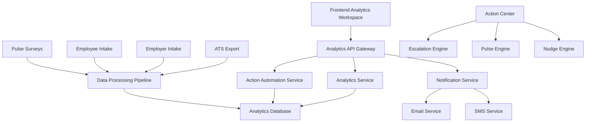

# YourPipeline Analytics Spec V1 - Plan of Action

## Executive Summary

This document outlines the comprehensive implementation plan for YourPipeline Analytics V1, an enterprise-grade analytics workspace designed to drive retention outcomes for pilot healthcare facilities. The system will deliver actionable insights with embedded interventions, enabling facility leaders to identify retention risks and trigger Pipeline-native interventions within 5 minutes.

## Current State Analysis

### Existing Infrastructure
- **Frontend**: Next.js dashboard with existing analytics components (`/your-pipeline/page.tsx`)
- **Backend**: NestJS API with Prisma ORM and PostgreSQL database
- **Analytics**: Basic tracking system with `analytics_events`, `job_views`, `apply_clicks` tables
- **User Management**: Role-based access (CANDIDATE, EMPLOYER, ADMIN)
- **Data Models**: Basic job, user, and candidate models with healthcare-specific enums

### Current Analytics Capabilities
- Job view and application tracking
- Basic user session analytics
- Admin analytics dashboard
- CSV export functionality
- Real-time event tracking

## Implementation Strategy

### Phase 1: Foundation & Data Architecture (Weeks 1-2)

#### 1.1 Database Schema Extensions
**Priority: Critical**

Extend the existing Prisma schema to support analytics requirements:

```prisma
// New models for analytics system
model facilities {
  id                String   @id @default(uuid())
  name              String
  type              String   // hospital, ltc, rehab, etc.
  location          String
  contactEmail      String
  contactPhone      String?
  createdAt         DateTime @default(now())
  updatedAt         DateTime @updatedAt
  
  // Relations
  employees         employees[]
  pulse_surveys     pulse_surveys[]
  retention_forecasts retention_forecasts[]
  action_items      action_items[]
  complaints        complaints[]
}

model employees {
  id                String   @id @default(uuid())
  facilityId        String
  userId            String?  // Link to existing users table
  firstName         String
  lastName          String
  email             String
  role              HealthcareRole
  department        String?
  unit              String?
  hireDate          DateTime
  status            String   @default("active") // active, inactive, terminated
  retentionRisk     Float?  // 0-1 risk score
  createdAt         DateTime @default(now())
  updatedAt         DateTime @updatedAt
  
  // Relations
  facility          facilities @relation(fields: [facilityId], references: [id])
  pulse_responses   pulse_responses[]
  retention_forecasts retention_forecasts[]
  action_items      action_items[]
  
  @@index([facilityId])
  @@index([role])
  @@index([status])
}

model pulse_surveys {
  id                String   @id @default(uuid())
  facilityId        String
  title             String
  questions         Json     // Survey questions structure
  targetRoles       HealthcareRole[]
  targetUnits       String[]
  status            String   @default("draft") // draft, active, completed
  scheduledAt       DateTime?
  completedAt       DateTime?
  createdAt         DateTime @default(now())
  updatedAt         DateTime @updatedAt
  
  // Relations
  facility          facilities @relation(fields: [facilityId], references: [id])
  responses         pulse_responses[]
  
  @@index([facilityId])
  @@index([status])
}

model pulse_responses {
  id                String   @id @default(uuid())
  surveyId          String
  employeeId        String
  responses         Json     // Survey response data
  sentimentScore    Float?   // Calculated sentiment
  submittedAt       DateTime @default(now())
  
  // Relations
  survey            pulse_surveys @relation(fields: [surveyId], references: [id])
  employee          employees @relation(fields: [employeeId], references: [id])
  
  @@unique([surveyId, employeeId])
  @@index([surveyId])
  @@index([employeeId])
}

model retention_forecasts {
  id                String   @id @default(uuid())
  facilityId        String
  employeeId        String?
  cohort            String   // e.g., "2024-Q1", "new-hires-30d"
  forecastType      String   // 30d, 60d, 90d
  predictedRetention Float   // 0-1 probability
  confidence        Float    // 0-1 confidence score
  factors           Json     // Contributing factors
  calculatedAt      DateTime @default(now())
  
  // Relations
  facility          facilities @relation(fields: [facilityId], references: [id])
  employee          employees? @relation(fields: [employeeId], references: [id])
  
  @@index([facilityId])
  @@index([forecastType])
  @@index([calculatedAt])
}

model action_items {
  id                String   @id @default(uuid())
  facilityId        String
  employeeId        String?
  actionType        String   // escalate, pulse, nudge, etc.
  category          String   // hiring, retention, sentiment, etc.
  title             String
  description       String
  priority          String   // low, medium, high, critical
  status            String   @default("pending") // pending, in_progress, completed, cancelled
  assignedTo        String?  // Email or role
  dueDate           DateTime?
  completedAt       DateTime?
  metadata          Json?    // Additional action-specific data
  createdAt         DateTime @default(now())
  updatedAt         DateTime @updatedAt
  
  // Relations
  facility          facilities @relation(fields: [facilityId], references: [id])
  employee          employees? @relation(fields: [employeeId], references: [id])
  
  @@index([facilityId])
  @@index([actionType])
  @@index([status])
  @@index([dueDate])
}

model complaints {
  id                String   @id @default(uuid())
  facilityId        String
  employeeId        String?
  category          String   // safety, harassment, culture, etc.
  description       String
  severity          String   // low, medium, high, critical
  status            String   @default("open") // open, investigating, resolved, closed
  reportedAt        DateTime @default(now())
  resolvedAt        DateTime?
  metadata          Json?    // Additional complaint data
  
  // Relations
  facility          facilities @relation(fields: [facilityId], references: [id])
  employee          employees? @relation(fields: [employeeId], references: [id])
  
  @@index([facilityId])
  @@index([category])
  @@index([severity])
  @@index([status])
}

model analytics_insights {
  id                String   @id @default(uuid())
  facilityId        String
  insightType       String   // retention_drop, sentiment_decline, etc.
  title             String
  description       String
  severity          String   // info, warning, critical
  data              Json     // Supporting data
  actions           Json?    // Suggested actions
  generatedAt       DateTime @default(now())
  acknowledgedAt    DateTime?
  
  // Relations
  facility          facilities @relation(fields: [facilityId], references: [id])
  
  @@index([facilityId])
  @@index([insightType])
  @@index([severity])
  @@index([generatedAt])
}
```

#### 1.2 Data Migration Strategy
- Create migration scripts for existing data
- Implement data seeding for pilot facilities
- Set up data validation and integrity checks

### Phase 2: Backend API Development (Weeks 3-4)

#### 2.1 Analytics Service Layer
**Priority: Critical**

Create comprehensive analytics services:

```typescript
// analytics.service.ts
@Injectable()
export class AnalyticsService {
  // KPI Calculation Methods
  async calculateRetentionForecast(facilityId: string, timeframe: string): Promise<number>
  async calculateNoShowRisk(facilityId: string): Promise<number>
  async calculateTurnoverCostAvoided(facilityId: string): Promise<number>
  
  // Insight Generation
  async generateInsights(facilityId: string): Promise<Insight[]>
  async detectRetentionRisk(facilityId: string): Promise<RiskAlert[]>
  async analyzeSentimentTrends(facilityId: string): Promise<SentimentAnalysis>
  
  // Cohort Analysis
  async getCohortAnalysis(facilityId: string, cohortType: string): Promise<CohortData>
  async getFunnelMetrics(facilityId: string): Promise<FunnelMetrics>
  
  // Hotspot Analysis
  async getUnitHotspots(facilityId: string): Promise<HotspotData[]>
  async getRoleHotspots(facilityId: string): Promise<HotspotData[]>
}
```

#### 2.2 Action Automation Service
**Priority: High**

Implement automated action triggers:

```typescript
// action-automation.service.ts
@Injectable()
export class ActionAutomationService {
  // Action Triggers
  async checkRetentionForecastDrops(): Promise<void>
  async checkSentimentDeclines(): Promise<void>
  async checkComplaintSpikes(): Promise<void>
  async checkPulseParticipation(): Promise<void>
  
  // Action Execution
  async escalateToSupervisor(actionData: EscalationData): Promise<void>
  async sendTargetedPulse(actionData: PulseData): Promise<void>
  async sendCandidateNudge(actionData: NudgeData): Promise<void>
  async createActionItem(actionData: ActionItemData): Promise<void>
  
  // Automation Rules
  async processAutomationRules(facilityId: string): Promise<void>
  async executeSafeActions(): Promise<void>
  async queueConfirmationActions(): Promise<void>
}
```

#### 2.3 API Endpoints
**Priority: High**

Create RESTful APIs for analytics data:

```typescript
// Analytics Controller Endpoints
GET /api/analytics/kpis/:facilityId
GET /api/analytics/insights/:facilityId
GET /api/analytics/cohorts/:facilityId
GET /api/analytics/hotspots/:facilityId
GET /api/analytics/actions/:facilityId

// Action Controller Endpoints
POST /api/actions/escalate
POST /api/actions/pulse
POST /api/actions/nudge
PUT /api/actions/:actionId/status
GET /api/actions/:facilityId/pending

// Pulse Survey Endpoints
POST /api/pulse/surveys
GET /api/pulse/surveys/:facilityId
POST /api/pulse/surveys/:surveyId/responses
GET /api/pulse/surveys/:surveyId/results
```

### Phase 3: Frontend Analytics Workspace (Weeks 5-6)

#### 3.1 Analytics Dashboard Components
**Priority: Critical**

Build modular analytics components:

```typescript
// Components Structure
components/
├── analytics/
│   ├── KPICard.tsx              // Individual KPI display
│   ├── InsightFeed.tsx           // Narrative insights with actions
│   ├── CohortAnalysis.tsx        // Cohort and funnel visualization
│   ├── HotspotMatrix.tsx        // Unit/role heatmap
│   ├── ActionCenter.tsx          // Action management interface
│   ├── GlobalControls.tsx        // Date range, filters, export
│   └── RetentionForecast.tsx     // Retention prediction display
```

#### 3.2 KPI Cards Implementation
**Priority: Critical**

Implement the three core KPI cards:

```typescript
// Retention Forecast Card
interface RetentionForecastData {
  percentage30d: number;
  percentage60d: number;
  percentage90d: number;
  trend: 'up' | 'down' | 'stable';
  riskLevel: 'low' | 'medium' | 'high';
}

// No-Show Risk Card
interface NoShowRiskData {
  flaggedCount: number;
  totalCandidates: number;
  riskPercentage: number;
  trend: 'up' | 'down' | 'stable';
}

// Turnover Cost Avoided Card
interface TurnoverCostData {
  estimatedSavings: number;
  hiresRetained: number;
  timeSaved: number;
  roi: number;
}
```

#### 3.3 Insight Feed System
**Priority: High**

Create dynamic insight generation and display:

```typescript
// Insight Types
interface Insight {
  id: string;
  type: 'retention_drop' | 'sentiment_decline' | 'complaint_spike' | 'participation_drop';
  title: string;
  description: string;
  severity: 'info' | 'warning' | 'critical';
  actions: Action[];
  data: any;
  generatedAt: Date;
}

// Action Interface
interface Action {
  id: string;
  type: 'escalate' | 'pulse' | 'nudge' | 'manual';
  title: string;
  description: string;
  actor: 'employer' | 'candidate';
  channel: 'email' | 'sms' | 'in_app' | 'notification';
  automationLevel: 'safe' | 'confirm' | 'manual';
}
```

### Phase 4: Action Automation System (Weeks 7-8)

#### 4.1 Automation Rules Engine
**Priority: High**

Implement the action matrix from the spec:

```typescript
// Automation Rules
const automationRules = {
  // Hiring Funnel Rules
  candidateNoShowRisk: {
    trigger: 'risk_score_drops',
    condition: 'incomplete_intake + no_response_sla',
    action: 'escalate_to_hr_manager',
    automation: 'confirm'
  },
  
  orientationFillRate: {
    trigger: 'fill_rate_low',
    condition: '<80%_planned_slots',
    action: 'escalate_to_hr_recruiter',
    automation: 'confirm'
  },
  
  // Retention Rules
  retentionForecastDrop: {
    trigger: 'forecast_drops',
    condition: '>10pts_below_baseline',
    action: 'escalate_to_supervisor',
    automation: 'confirm'
  },
  
  // Sentiment Rules
  pulseSentimentDecline: {
    trigger: 'sentiment_drops',
    condition: '>1σ_drop_14day_rolling',
    action: 'send_targeted_pulse',
    automation: 'confirm'
  },
  
  // Safety Rules
  safetyAlert: {
    trigger: 'safety_keywords',
    condition: 'unsafe_harassment_detected',
    action: 'auto_escalate_compliance',
    automation: 'auto'
  }
};
```

#### 4.2 Notification System
**Priority: High**

Implement multi-channel notification system:

```typescript
// Notification Service
@Injectable()
export class NotificationService {
  async sendEmailEscalation(escalationData: EscalationData): Promise<void>
  async sendSMSPulse(pulseData: PulseData): Promise<void>
  async sendInAppNotification(notificationData: NotificationData): Promise<void>
  async sendWeeklyBrief(facilityId: string): Promise<void>
}
```

### Phase 5: Integration & Testing (Weeks 9-10)

#### 5.1 Data Integration
**Priority: High**

- Integrate with existing ATS export capabilities
- Implement employer intake data processing
- Connect with existing employee intake system
- Set up real-time data synchronization

#### 5.2 Testing Strategy
**Priority: Critical**

- Unit tests for all analytics calculations
- Integration tests for action automation
- End-to-end tests for complete workflows
- Performance testing for large datasets
- User acceptance testing with pilot facilities

### Phase 6: Deployment & Pilot Launch (Weeks 11-12)

#### 6.1 Pilot Facility Onboarding
**Priority: Critical**

- Set up pilot facility data
- Configure automation rules
- Train facility administrators
- Monitor system performance

#### 6.2 Success Metrics Tracking
**Priority: High**

Implement tracking for success metrics:
- ≥80% open rate for Snapshot weekly briefs
- ≥2 actionable insights addressed per facility per week
- ≥60% pulse participation rate in targeted cohorts
- ≥70% intake completion among candidates
- Demonstrable reduction in no-shows / early attrition

## Technical Architecture

### System Components



### Data Flow

1. **Data Ingestion**: ATS exports, intake forms, pulse surveys
2. **Analytics Processing**: Real-time calculation of KPIs and insights
3. **Action Triggering**: Automated detection of risk patterns
4. **Action Execution**: Escalations, pulses, nudges via appropriate channels
5. **Feedback Loop**: Action outcomes feed back into analytics

## Risk Mitigation

### Technical Risks
- **Data Quality**: Implement validation and cleansing pipelines
- **Performance**: Use caching and optimized queries for large datasets
- **Scalability**: Design for horizontal scaling of analytics services

### Business Risks
- **User Adoption**: Provide comprehensive training and support
- **Action Fatigue**: Implement smart filtering and prioritization
- **Compliance**: Ensure all actions comply with healthcare regulations

## Success Criteria

### Technical Success
- System processes 1000+ employees per facility
- Sub-second response times for KPI calculations
- 99.9% uptime for analytics services
- Zero data loss during action execution

### Business Success
- 5-minute time-to-insight for facility leaders
- 20% reduction in early attrition rates
- 30% improvement in pulse participation
- Positive ROI within 6 months

## Timeline Summary

| Phase | Duration | Key Deliverables |
|-------|----------|------------------|
| Phase 1 | Weeks 1-2 | Database schema, data models |
| Phase 2 | Weeks 3-4 | Backend APIs, analytics services |
| Phase 3 | Weeks 5-6 | Frontend workspace, KPI cards |
| Phase 4 | Weeks 7-8 | Action automation, notifications |
| Phase 5 | Weeks 9-10 | Integration, testing |
| Phase 6 | Weeks 11-12 | Deployment, pilot launch |

## Next Steps

1. **Immediate Actions** (This Week):
   - Review and approve this plan
   - Set up development environment
   - Begin database schema design
   - Identify pilot facility requirements

2. **Week 1-2 Priorities**:
   - Complete database schema implementation
   - Set up development and staging environments
   - Begin backend service development
   - Create initial data models and migrations

3. **Stakeholder Communication**:
   - Present plan to pilot facilities
   - Gather feedback on automation rules
   - Establish success metrics baseline
   - Schedule regular progress reviews

This comprehensive plan provides a roadmap for implementing YourPipeline Analytics V1, delivering enterprise-grade analytics with embedded actions to drive retention outcomes for pilot healthcare facilities.
